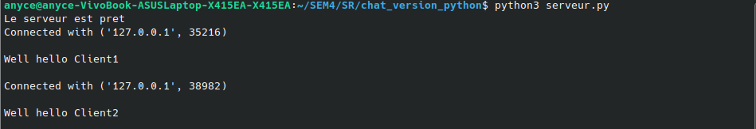
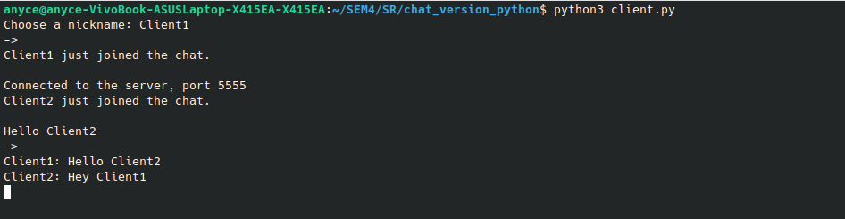
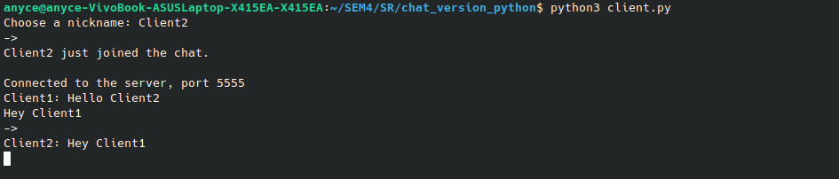

# RSCHAT

Un simple chat sécurisé avec le système de RSA.

## Logiciels
Ce projet à été crée avec : <br>
- Python 3.10 <br>
- TKinter <br>
- Pads <br>

## Setup

### Instalation

Clonez le dépôt sur votre machine :

```
git clone git@code.up8.edu:fgodin/p8-mini-chat.git
```

### Utilisation

Pour démarrer le serveur, ouvrez un terminal et exécutez :

```
python3 serveur.py
```


Pour démarrer le client, ouvrez un ou plusieurs terminaux et exécutez :

```
python3 client.py
```

### Exemple

.

.

.

## Contributeurs

[@fgodin](https://code.up8.edu/fgodin)<br>
[@dhullot](https://code.up8.edu/dhullot)<br>
[@mhimeur](https://code.up8.edu/mhimeur)<br>
[@Valentin_G](https://code.up8.edu/Valentin_G)<br>
[@nsougoumar](https://code.up8.edu/nsougoumar)<br>
[@aekomono](https://code.up8.edu/aekomono)<br>

## Ressources

Lien pads : [Consignes du projet](https://pads.up8.edu/rj6S3VS3R5W_QRial1zb7g#)